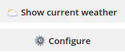
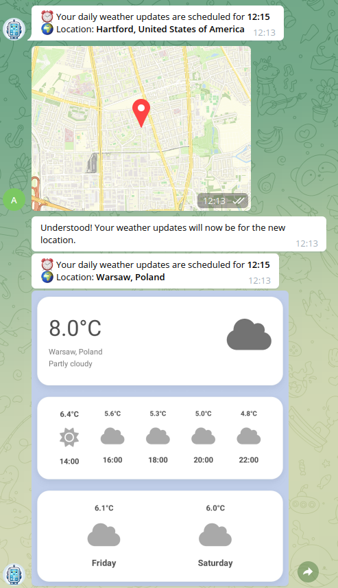

[.text-justify]
= Weather Mantra
:reproducible:
:doctype: article
:author: Henryk Ciechanowiec
:email: henryk.ciechanowiec@gmail.com
:chapter-signifier:
:sectnums:
:sectnumlevels: 5
:sectanchors:
:toc: left
:toclevels: 5
:icons: font
// Docinfo is used for foldable TOC.
// -> For full usage example see https://github.com/remkop/picocli
:docinfo: shared,private
:linkcss:
:stylesdir: https://www.ciechanowiec.eu/linux_mantra/
:stylesheet: adoc-css-style.css

== Overview

_Weather Mantra_ is a Telegram bot designed to send weather reports to the user on a daily basis.
To receive these reports, the user should specify his location and the time he wants to receive them.
Additionally, the bot offers an option to send weather reports for the current time.

== Usage

When the user first starts the bot, he must select his location and a time for receiving daily weather reports.
He can adjust these settings later if he wishes.

The location can be sent as a Telegram attachment of the type "location".
Time can be sent in this format: *HH:mm*; the hour can be either a single digit or a double-digit.

After the user specifies his location and time at the first usage, he will be shown these buttons:

.Buttons

By clicking the "Configure" button, the user will be shown instructions on how to change his time or location.
By clicking the "Show current weather" button, the user will get a weather report for the current time.

When the time for the weather report arrives, or the user asks for a current weather report, the user will receive one.
It will look like this:

.Example of Using Bot

In this image, the user will see the current temperature and the location.
The current weather condition will be specified under the location in a descriptive manner and on the right part of the block as an icon.
Additionally, the report will show the forecast for the current day with a gap of 2 hours (the current hour will be rounded up to the next hour starting from 30 minutes, e.g., 10:30 will be treated as 11 and the forecast will begin from 13).
In the last block, the user will get the forecast for the next two days.

== Architecture

The program is built on a microservices architecture and comprised of three of them, described in the following sections.

=== Bot

Bot is the key microservice, which handles all user interactions.
Messages received are classified into 10 various types:

[num]
.. START
.. CONFIG
.. SHOW_CURRENT_SETTINGS
.. SHOW_CURRENT_WEATHER
.. ASK_LOCATION
.. ASK_TIME
.. UNKNOWN
.. SAVE_LOCATION
.. SAVE_TIME
.. DEFAULT

The processing of these messages relies on the idea of specialized processors.
Each processor is tasked with a particular message type and can either respond directly to the user and wait for his input or forward the message to another processor.
The type of message is determined based on its content or the artificially assigned type by another processor.

=== Screenshotter

The primary function of the screenshotter is to capture and return screenshots through an HTTP response.
Its workflow is as follows:

[num]
. Receive a request with parameters.
. Fetch content from an external website.
. Capture a screenshot of the page.
. Return the screenshot in the response.

=== Templater

Templater is centered around Spring MVC, this service responds to GET HTTP requests with location data.
It queries a Weather API for current and forecast weather data, then integrates this information into a view (HTML page).

Weather API: https://www.weatherapi.com

=== Workflow

The complete workflow of the program is as follows:

[num]
. The Bot initiates the process to send a weather report.
. The Bot retrieves the user's location data from the database.
. The Bot sends a request with location data to the Screenshotter.
. The Screenshotter forwards the request, including location data, to the Templater.
. The Templater sends a request to the Weather API using the provided location data.
. The Templater receives weather data from the Weather API.
. The Templater pollutes the view (HTML template) with weather data.
. Templater exposes the created HTML page to the web.
. The Screenshotter captures a screenshot of the weather report provided by the Templater.
. The Screenshotter sends the screenshot back to the Bot.
. The Bot receives the screenshot from the Screenshotter.
. The Bot delivers the weather report to the user.

== License

The program is subject to MIT No Attribution License

Copyright © 2024 Henryk Ciechanowiec

Permission is hereby granted, free of charge, to any person obtaining a copy of this software and associated documentation files (the 'Software'), to deal in the Software without restriction, including without limitation the rights to use, copy, modify, merge, publish, distribute, sublicense, and/or sell copies of the Software, and to permit persons to whom the Software is furnished to do so.

The Software is provided 'as is', without warranty of any kind, express or implied, including but not limited to the warranties of merchantability, fitness for a particular purpose and noninfringement.
In no event shall the authors or copyright holders be liable for any claim, damages or other liability, whether in an action of contract, tort or otherwise, arising from, out of or in connection with the Software or the use or other dealings in the Software.
